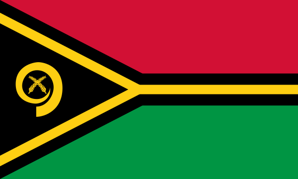

# Vanuatu Educational Dashboard

## Overview
The Vanuatu Educational Dashboard is an interactive web application built with Streamlit that provides comprehensive analysis and visualization of Vanuatu's education system. This dashboard integrates historical context, demographic data, and educational statistics to present a holistic view of education in Vanuatu, with particular focus on language policy, decolonization efforts, curriculum reforms, and regional distribution of educational resources.

**Live Demo: [https://vanuatueducation.streamlit.app/](https://vanuatueducation.streamlit.app/)**

## Features
- **Executive Summary**: Concise overview of key findings and insights about Vanuatu's education system
- **Historical Context**: Analysis of colonial legacy and independence influences on education
- **Global Comparison**: Interactive comparisons using Happy Planet Index (HPI) metrics
- **Population Demographics**: Visualization of population trends with focus on school-age populations
- **Higher Education Analysis**: Comprehensive view of tertiary institutions and their development
- **Educational Distribution**: Province-level visualization of enrollment patterns
- **Gender Equity Analysis**: Data-driven insights into gender distribution in education
- **Age Distribution Analysis**: Visualization of age-based enrollment patterns
- **Teaching Resources**: Analysis of teacher distribution across provinces

## Data Sources
The dashboard utilizes multiple data sources:
- Vanuatu Ministry of Education datasets
- Happy Planet Index (HPI) global rankings
- Population statistics from national census (2009-2020)
- Academic literature and research on educational policy in Vanuatu

## Installation and Setup

### Prerequisites
- Python 3.8+
- pip or conda package manager

### Installation Steps
1. Clone the repository: